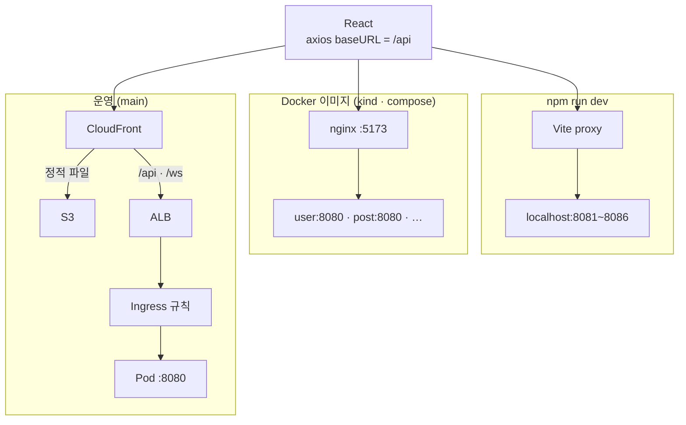
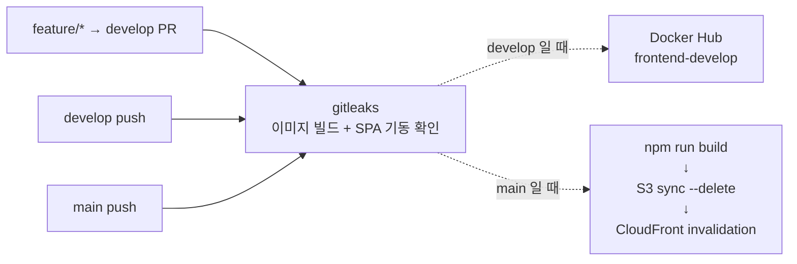

# frontend

GameHouse의 단일 React SPA. 백엔드는 6개로 나뉘어 있지만 사용자가 보는 것은 한 화면이다.

| | |
|---|---|
| 스택 | React 18 · Vite 5 · React Router 6 · axios · STOMP over SockJS |
| 진입점 | `index.html` → `src/main.jsx` → `src/App.jsx` |
| 산출물 | `dist/` — 정적 파일. 서버 렌더링 없음 |
| 배포 | `develop` → nginx Docker 이미지 / `main` → S3 + CloudFront |

---

## 1. 이 레포의 핵심 규칙

**프론트 코드는 백엔드 서비스의 주소를 모른다.**

axios `baseURL` 은 `/api` 하나뿐이고, 코드에 등장하는 것은 전부 상대경로다.

```js
// src/api/match.js
api.post('/match/search', body)   // → /api/match/search
```

서비스별 주소를 `baseURL` 에 박지 않은 이유는 셋이다.

- 백엔드를 더 쪼개거나 합칠 때마다 프론트를 같이 고쳐야 한다
- 로컬/운영 주소 분기가 프론트 코드로 새어 들어온다
- 서비스를 나눈 목적(한쪽 변경이 다른 쪽에 안 번지게)이 무너진다

**"어느 서비스로 갈지"는 인프라가 정한다.** 그래서 이 판단은 프론트 코드가 아니라 아래 세 파일에 들어 있다.

| 환경 | 누가 갈라주나 | 파일 |
|---|---|---|
| `npm run dev` | Vite dev server proxy | `vite.config.js` |
| Docker 이미지 (kind · compose) | 컨테이너 안의 nginx | `nginx/default.conf.template` |
| 운영 (EKS) | ALB Ingress | infra 레포 `k8s/components/aws/ingress.yaml` |

> ⚠️ **새 엔드포인트를 추가하면 세 곳을 모두 고쳐야 한다.**
> 한 곳만 고치면 개발에서는 되는데 운영에서 404가 난다. 그 반대도 마찬가지다.

---

## 2. 경로 → 서비스 라우팅표

위 세 파일이 공유하는 실제 규칙이다.

| 경로 | 서비스 | 무엇 |
|---|---|---|
| `/api/auth` | **user** | 로그인 · 회원가입 · 중복확인 |
| `/api/users` | **user** | 프로필 · 아이디/비밀번호 찾기 · 라이엇 연동 · 설문 |
| `/api/friends` | **user** | 친구 |
| `/api/notifications` | **user** | 알림 |
| `/uploads` | **user** | 프로필 이미지 (파일을 user 가 소유한다) |
| `/api/posts` | **post** | 파티 모집글 |
| `/api/applications` | **post** | 모집글 신청 |
| `/api/my` | **post** | `/my/posts` · `/my/applications` — 이름과 달리 user 가 아니라 post 소유다 |
| `/api/chat` | **chat** | 채팅방 · 메시지 |
| `/ws` | **chat** | 채팅 WebSocket (SockJS/STOMP) |
| `/api/match` | **match** | 파티 검색 결과 추천 · 노출/클릭/지원 로그 |
| `/api/crew` | **crew** | House 목록 · 상세 · 공지 · 일정 · 추천 |
| `/api/houses` | **crew** | House 단건 조회 |
| `/api/shop` | **crew** | 커스터마이징 상점 |
| `/ws-house` | **crew** | House 채팅 WebSocket |

**riot 은 이 표에 없다.** 브라우저가 직접 부르지 않는 클러스터 내부 전용 서비스다.
라이엇 연동은 `/api/users/riot/*` 로 **user 를 거쳐** 간다.

**`/api` catch-all 은 일부러 두지 않았다.**
규칙에 없는 경로는 개발에서 곧바로 실패해야 Ingress 규칙 누락을 배포 전에 발견할 수 있다.
컨테이너의 nginx 도 같은 이유로 `/api/` 는 `index.html` 로 fallback 시키지 않고 JSON 404를 돌려준다. SPA fallback이 API 오류를 HTML 200으로 덮어버리면 원인을 찾을 수 없다.

---

## 3. 요청이 가는 길

환경마다 갈라주는 주체가 다를 뿐, **프론트가 보내는 요청은 세 경우 모두 똑같다.**



**로컬 포트** — user `8081` · post `8082` · chat `8083` · riot `8084` · match `8085` · crew `8086`
클러스터 안에서는 모두 `8080` 이다. 그래서 `vite.config.js` 에만 포트가 나오고 나머지 두 곳에는 서비스 이름만 나온다.

**운영에는 프론트 Pod 가 없다.** 정적 파일은 S3에 있고 CloudFront가 서빙한다. ALB로 넘어가는 것은 `/api` 와 `/ws` 뿐이다.

---

## 4. 설정은 빌드가 아니라 런타임에 주입된다

`import.meta.env` 를 읽지 않는다. 값은 항상 `window.__ENV__` 로 들어온다.

```
index.html  ──<script src="/config.js">──>  window.__ENV__  ──>  src/config.js
```

| 환경 | `/config.js` 를 만드는 주체 |
|---|---|
| `npm run dev` | `public/config.js` (상대경로 기본값) |
| 컨테이너 | `docker-entrypoint.sh` 가 환경변수를 읽어 생성 |

| 키 | 기본값 | 쓰임 |
|---|---|---|
| `API_BASE_URL` | `/api` | axios baseURL |
| `WS_URL` | `/ws` | STOMP 접속 주소 |
| `BACKEND_ORIGIN` | `""` | 업로드 파일이 다른 오리진에 있을 때만 prefix로 붙는다 (`assetUrl()`) |

**이 구조를 택한 이유는 이미지에 URL을 박지 않기 위해서다.**
빌드 타임에 주소를 넣으면 환경마다 이미지를 따로 빌드해야 한다. 런타임 주입이면 같은 이미지를 어디든 띄울 수 있다.
셋 다 안 주면 entrypoint는 아무것도 하지 않고 빌드에 포함된 상대경로 기본값이 그대로 쓰인다 — ALB same-origin 운영이 이 경우다.

예외가 하나 있다. 로컬 호스트(`localhost` · `127.0.0.1`)에서는 `WS_URL` 을 무조건 `/ws` 로 강제한다. 운영 설정이 남아 있는 `config.js` 때문에 로컬 개발이 엉뚱한 곳에 붙는 일을 막는다.

---

## 5. 배포 — develop 과 main 이 다르다



| | develop | main |
|---|---|---|
| 산출물 | nginx Docker 이미지 | `dist/` 정적 파일 |
| 배포처 | Docker Hub | S3 + CloudFront |
| 인증 | Docker Hub 토큰 | GitHub OIDC → AWS IAM Role |

**main 에서도 이미지 빌드는 한다.** 배포에 쓰지는 않고 빌드가 깨지지 않는지 확인하는 용도다.
검증은 이미지를 띄운 뒤 `HTTP 200` 과 `<div id="root">` 가 함께 나오는지 확인한다. 두 조건을 같이 보는 이유는, nginx가 살아만 있고 빌드 결과가 비어 있어도 200이 나오기 때문이다.

`aws s3 sync --delete` 를 쓴다. 이전 빌드의 해시 붙은 asset이 남으면 버킷이 계속 불어난다.
그 뒤 CloudFront 전체 경로(`/*`)를 무효화한다. `index.html` 이 캐시에 남아 있으면 새 asset을 가리키지 못한다.

EC2 SSM 배포 job 이 `if: false` 로 남아 있다. 예전 dev 구조로 되돌릴 경우를 위한 보존 코드다.

---

## 6. 화면

`Private` 로 감싼 것은 비로그인 시 `/login` 으로 보내고, 원래 가려던 경로를 `state.from` 에 담아 로그인 후 되돌린다.

| 그룹 | 라우트 |
|---|---|
| 메인 | `/` |
| 인증 | `/login` · `/signup` · `/find-id` · `/find-password` |
| 가입 설문 | `/signup/survey` · `/signup/playstyle` · `/signup/confirm` |
| 모집글 | `/post/:id` · 🔒 `/post/new` · 🔒 `/post/:id/edit` · `/post/:id/applicants` |
| 채팅 | 🔒 `/chat` · 🔒 `/chat/:roomId` |
| 친구 · 프로필 | 🔒 `/friends` · 🔒 `/profile/:id` |
| House | `/houses` · `/houses/rankings` · `/houses/:houseId` · 🔒 `/houses/new` · 🔒 `/houses/:houseId/chat` · 🔒 `/houses/:houseId/settings` |
| 커스터마이징 | 🔒 `/customization` · 🔒 `/customization/shop` |
| 마이페이지 | 🔒 `/mypage` · 🔒 `/mypage/edit` |
| 그 외 | `*` → `/` 로 리다이렉트 |

🔒 = 로그인 필요

개발 전용 라우트가 둘 있다. `/chat/preview` 와 `/houses/suggestions/preview` 는 `import.meta.env.DEV` 일 때만 붙고, 운영 빌드에서는 아예 존재하지 않는다.

---
