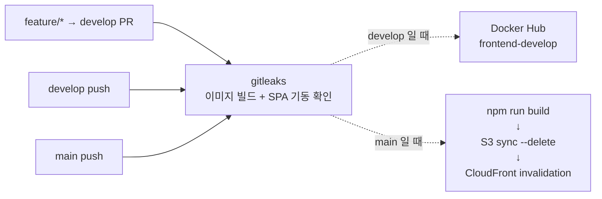

# frontend

## 1. 배포 — develop 과 main 이 다르다



| | develop | main |
|---|---|---|
| 산출물 | nginx Docker 이미지 | `dist/` 정적 파일 |
| 배포처 | Docker Hub | S3 + CloudFront |
| 인증 | Docker Hub 토큰 | GitHub OIDC → AWS IAM Role |

**운영에는 프론트 Pod 가 없다.** 정적 파일은 S3에 있고 CloudFront가 서빙한다. ALB로 넘어가는 것은 `/api` 와 `/ws`, '/ws-house' 뿐이다.

**main 에서도 이미지 빌드는 한다.** 배포에 쓰지는 않고 빌드가 깨지지 않는지 확인하는 용도다.
검증은 이미지를 띄운 뒤 `HTTP 200` 과 `<div id="root">` 가 함께 나오는지 확인한다. 두 조건을 같이 보는 이유는, nginx가 살아만 있고 빌드 결과가 비어 있어도 200이 나오기 때문이다.

`aws s3 sync --delete` 를 쓴다. 이전 빌드의 해시 붙은 asset이 남으면 버킷이 계속 불어난다.
그 뒤 CloudFront 전체 경로(`/*`)를 무효화한다. `index.html` 이 캐시에 남아 있으면 새 asset을 가리키지 못한다.

EC2 SSM 배포 job 이 `if: false` 로 남아 있다. 예전 dev 구조로 되돌릴 경우를 위한 보존 코드다.

---

## 2. 화면

`Private` 로 감싼 것은 비로그인 시 `/login` 으로 보내고, 원래 가려던 경로를 `state.from` 에 담아 로그인 후 되돌린다.

| 그룹 | 라우트 |
|---|---|
| 메인 | `/` |
| 인증 | `/login` · `/signup` · `/find-id` · `/find-password` |
| 가입 설문 | `/signup/survey` · `/signup/playstyle` · `/signup/confirm` |
| 모집글 | `/post/:id` · `/post/:id/applicants` · 🔒 `/post/new` · 🔒 `/post/:id/edit` |
| 채팅 | 🔒 `/chat` · 🔒 `/chat/:roomId` |
| 친구 · 프로필 | 🔒 `/friends` · 🔒 `/profile/:id` |
| House | `/houses` · `/houses/rankings` · `/houses/:houseId` · 🔒 `/houses/new` · 🔒 `/houses/:houseId/chat` · 🔒 `/houses/:houseId/settings` |
| 커스터마이징 | 🔒 `/customization` · 🔒 `/customization/shop` |
| 마이페이지 | 🔒 `/mypage` · 🔒 `/mypage/edit` |
| 그 외 | `*` → `/` 로 리다이렉트 |

🔒 = 로그인 필요

개발 전용 라우트가 둘 있다. `/chat/preview` 와 `/houses/suggestions/preview` 는 `import.meta.env.DEV` 일 때만 붙고, 운영 빌드에서는 아예 존재하지 않는다.

---

## 4. 디렉터리 구조

```
src/
├── api/          8    백엔드 호출. 화면은 여기만 부른다
├── pages/       41    라우트 하나당 파일 하나 (+ 페이지 전용 CSS)
├── components/  27    화면 간 공유 UI
├── context/      3    Auth · Friend · Theme
├── mocks/        7    백엔드가 아직 없는 영역의 localStorage 저장소
├── assets/      97    로고 · 티어 아이콘 · 커스터마이징 이미지
├── config.js         런타임 설정 리더 (window.__ENV__)
├── constants.js      게임 · 포지션 · 티어 등 고정 목록
├── signupStore.js    가입 3단계에 걸친 입력값 보관
└── utils.js
```

| 디렉터리 | 규칙 |
|---|---|
| `api/` | `client.js` 가 axios 인스턴스 하나를 만들고 나머지가 그걸 쓴다. 요청에 토큰을 붙이고, 401이면 토큰을 지우고 `/login` 으로 보낸다 |
| `pages/` | 화면 하나 = 파일 하나. `App.jsx` 의 라우트 목록과 1:1 |
| `components/` | 두 화면 이상에서 쓰는 것만 올라온다. 한 화면 전용이면 그 페이지 파일 안에 둔다 |
| `context/` | 전역 상태는 이 셋뿐이다. 나머지는 각 페이지의 로컬 상태 |
| `mocks/` | 백엔드가 붙으면 대응하는 `api/*.js` 만 교체하면 되도록 경계를 잡아 두었다 |

**`api/` 바깥에서는 axios 를 직접 부르지 않는다.** 화면이 백엔드 주소나 응답 형태를 알게 되면 서비스 경계가 프론트로 새어 들어온다.

**401 을 받아도 튕기지 않는 경로가 있다.** `client.js` 의 `PUBLIC_PATHS`(`/auth` · `/users/find-email` · `/users/reset-password`)는 비로그인 상태로 부르는 경로다. 여기서 401에 반응해 `/login` 으로 보내면 회원가입 도중 입력값이 전부 날아간다.

**루트의 나머지**

| 경로 | 무엇 |
|---|---|
| `vite.config.js` | dev server 프록시 규칙 (3번 표의 첫 줄) |
| `nginx/` | Docker 이미지가 쓰는 nginx 설정 — SPA fallback + reverse proxy |
| `docker-entrypoint.sh` | 컨테이너 기동 시 환경변수를 읽어 `config.js` 와 nginx upstream 을 생성 |
| `public/config.js` | dev 기본 설정. 빌드 결과에도 포함된다 |
| `.env.example` | dev server 프록시 목적지 (앱이 읽는 설정이 아니다) |
